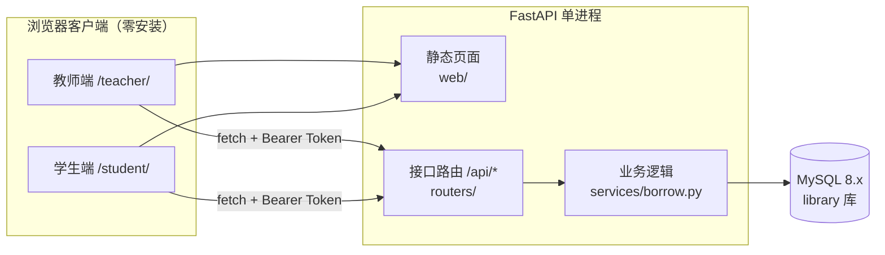

<div align="center">

# 图书管理系统

**FastAPI + 原生前端 + MySQL 的图书管理平台**

教师端与学生端双客户端 · 学号 / 工号登录 · 借还以馆藏条码为单位


</div>

<!-- 有截图后取消注释，并把图片放到 docs/ 目录下

-->

---

## 目录

- [功能](#功能)
- [技术栈](#技术栈)
- [系统架构](#系统架构)
- [快速开始](#快速开始)
- [默认账号](#默认账号)
- [借阅规则](#借阅规则)
- [设计要点](#设计要点)
- [目录结构](#目录结构)
- [常见问题](#常见问题)

---

## 功能

### 学生端 `/student/`

| 模块 | 说明 |
| --- | --- |
| 馆藏检索 | 按书名 / 作者 / ISBN / 中图法分类号查询；在馆的书可直接点「借书」借到自己名下 |
| 我的借阅 | 查看在借与历史记录，支持续借、还书 |
| 修改密码 | 校验原密码后修改 |

### 教师端 `/teacher/`

教师与管理员共用同一入口，管理类功能仅管理员可见。

| 模块 | 说明 | 权限 |
| --- | --- | --- |
| 馆藏检索 | 查询馆藏与在馆情况 | 教师 / 管理员 |
| 图书编目 | 录入书目、增减副本、按前缀批量生成条码 | 教师 / 管理员 |
| 借还办理 | 扫条码直接办理；**代他人借书仅管理员可用** | 教师 / 管理员 |
| 借阅记录 | 查询借阅明细 | 教师 / 管理员 |
| 逾期清单 | 列出逾期未还记录 | 教师 / 管理员 |
| 统计总览 | 馆藏量、在借量、逾期量等 | 教师 / 管理员 |
| 用户管理 | 批量建号、CSV 导入、增删改用户、重置密码 | 仅管理员 |
| 邀请码 | 生成教师注册邀请码 | 仅管理员 |

### 通用能力

- **JWT 双令牌**：access token（默认 120 分钟）+ refresh token（默认 14 天），401 时自动续期并重试一次
- **同账号顶号**：同一账号在新位置登录后，旧页面会被自动踢出并提示原因
- **登录态隔离**：会话存于 `sessionStorage`，按标签页隔离，关闭页面即退出登录
- **管理员保护**：`admin` 账号不可删除、不可禁用、不可重置密码，也不能通过管理接口创建新的管理员
- **逾期只提醒不罚款**：可配置逾期后是否仍允许借书
- **邀请码注册**：`/register.html` 供教师凭邀请码自助注册，邀请码有有效期

---

## 技术栈

| 层 | 选型 |
| --- | --- |
| 服务端框架 | FastAPI 0.115.6 + Uvicorn 0.34.0 |
| ORM / 驱动 | SQLAlchemy 2.0.36（`Mapped` 声明式）+ PyMySQL 1.1.1 |
| 认证 | python-jose（HS256）+ passlib\[bcrypt\] |
| 数据库 | MySQL 8.x（`utf8mb4`） |
| 前端 | 原生 HTML / CSS / JavaScript，无框架、无构建步骤 |
| 运行环境 | Python 3.11 |

---

## 系统架构



服务端一个进程同时提供接口（`/api`）和网页（`web/` 静态托管），因此客户端只需要浏览器，无需安装任何程序。

---

## 快速开始

### 1. 安装依赖

```bash
python -m venv .venv
.venv\Scripts\activate
pip install -r requirements.txt
```

### 2. 配置

复制 `.env.example` 为 `.env`，至少修改两项：

```ini
DB_PASSWORD=你的数据库密码
JWT_SECRET=换成随机值
```

随机密钥可以这样生成：

```bash
python -c "import secrets; print(secrets.token_urlsafe(48))"
```

### 3. 初始化数据库

```bash
.venv\Scripts\python.exe -m server.init_db
```

自动建库、建表并写入示例图书与账号。**可重复执行**，已有数据不会重复插入。

### 4. 启动服务端

```bash
.venv\Scripts\python.exe -m uvicorn server.main:app --host 127.0.0.1 --port 8000
```

也可以直接双击 `scripts\start-all.bat`，它会依次启动 MySQL、服务端并打开浏览器。

> `scripts\start-db.bat` 假设 `mysql\` 目录下是便携版 MySQL（该目录未随仓库提供，已在 `.gitignore` 中排除）。若使用自己安装的 MySQL，跳过该脚本，只启动服务端并把 `.env` 指向你的数据库。监听地址以启动命令的 `--host` 为准，`.env` 中的 `SERVER_HOST` 仅供代码读取。

### 5. 访问入口

| 入口 | 地址 |
| --- | --- |
| 客户端选择 | http://127.0.0.1:8000/ |
| 教师端 | http://127.0.0.1:8000/teacher/ |
| 学生端 | http://127.0.0.1:8000/student/ |
| 教师注册 | http://127.0.0.1:8000/register.html |
| 接口文档 | http://127.0.0.1:8000/docs |

---

## 默认账号

| 角色 | 账号 | 密码 |
| --- | --- | --- |
| 管理员 | `admin` | `admin123` |
| 教师 | `T1001`、`T1002` | `123456` |
| 学生 | `2024001`、`2024002` | `123456` |

> 以上为演示账号。**正式部署请立即修改管理员密码**，并删除不需要的示例账号。

---

## 借阅规则

规则集中在 `server/config.py`，调整规则只需改这一个文件。

| 项目 | 规则 |
| --- | --- |
| 可借册数 | 学生 5 册；教师 / 管理员 10 册（可按用户覆盖 `users.max_borrow`） |
| 借期 | 学生 30 天；教师 / 管理员 60 天 |
| 续借 | 最多 2 次，每次 15 天 |
| 逾期 | 只提醒不罚款；`ALLOW_BORROW_WHEN_OVERDUE` 控制逾期是否仍可借书 |

---

## 设计要点

**书目与副本分离**

`books` 是书目（一种书一行），`book_copies` 是副本（一册书一行，条码唯一）。借还、遗失、修补都以副本为单位，因此同一本书可以被多人同时借走不同的册。

**在借记录的唯一性由数据库保证**

`borrow_records` 使用生成列 `active_flag`（未还为 1、已还为 NULL）配合唯一索引 `uk_copy_active`，从数据库层保证「同一副本同时只存在一条在借记录」，不必依赖应用层的加锁判断。

**顶号机制**

用户表保存 `session_id`，每次登录轮换；JWT 载荷中携带 `sid`，每次请求与库中值比对，不一致即返回 401。前端不会被动等待下次请求失败——登录成功后启动 5 秒一次的心跳自检，并监听 `visibilitychange`，页面切回前台时立即补查，被顶下线后自动清空本地会话、跳回登录页并说明原因。

**登录态存储于 sessionStorage**

按标签页隔离且随页面关闭自动清除，天然满足「关掉网页即退出登录」，也不会出现同一台电脑的其它标签页捡到已登录会话的情况。

**密码存储**

使用 bcrypt 哈希，不保存明文；批量建号时用线程池并行计算哈希（bcrypt 计算过程会释放 GIL，实测 8 线程约有 5 倍提速）。

---

## 目录结构

```text
server/                  FastAPI 服务端
  main.py                应用入口，挂载 /api 路由与前端静态页面
  config.py              全部配置与借阅规则常量
  models.py              ORM 模型：用户 / 图书 / 副本 / 借阅记录 / 分类 / 邀请码
  schemas.py             请求与响应数据模型
  security.py            密码哈希与 JWT 签发校验
  deps.py                依赖注入：当前用户、角色校验
  init_db.py             建库、建表、写入示例数据（可重复执行）
  routers/               接口层
    auth.py              登录、注册、刷新令牌、修改密码
    books.py             图书与副本的增删改查
    borrow.py            借书、还书、续借
    categories.py        中图法分类
    invites.py           教师注册邀请码
    stats.py             统计总览
    users.py             用户管理、批量建号、CSV 导入
  services/borrow.py     借还业务逻辑与规则校验

web/                     前端页面，由服务端静态托管
  index.html             客户端选择入口
  login.html             登录
  register.html          教师邀请码注册
  teacher/index.html     教师端（含管理后台）
  student/index.html     学生端
  shared/api.js          接口封装：token 存取、401 自动刷新、错误统一处理
  shared/style.css       样式

scripts/                 Windows 一键脚本
  start-all.bat          启动 MySQL + 服务端，并打开浏览器
  start-db.bat           仅启动 MySQL
  stop-db.bat            停止 MySQL
  start-server.bat       仅启动服务端
  init-db.bat            初始化数据库

requirements.txt         Python 依赖
.env.example             配置模板（复制为 .env 使用）
```

---

## 常见问题

**中文出现问号**

连接串已统一附带 `charset=utf8mb4`，数据库也需为 `utf8mb4`。用 `init_db.py` 建库可自动保证字符集。

**改了前端代码页面没变化**

`web/` 目录的静态资源在服务端已禁用缓存（`Cache-Control: no-store`），正常刷新即可生效，无需清缓存。

**端口 8000 被占用**

改用其它端口启动，例如 `--port 8080`，同时注意 `.env` 中的 `SERVER_PORT` 仅供代码读取，不影响实际监听。

**忘了管理员密码**

用 `init_db.py` 不会覆盖已有账号。可临时用 Python 生成 bcrypt 哈希后直接更新数据库，或删掉 `users` 表中对应记录后重新执行初始化。

**能让局域网内其它设备访问吗**

把启动命令的 `--host` 改为 `0.0.0.0`（或 `::` 以同时支持 IPv6），在防火墙放行对应端口，其它设备用 `http://本机IP:8000/` 访问。注意此时应使用强密码，并建议通过 HTTPS 暴露到公网。

---

<div align="center">

本项目在 AI 辅助下开发

</div>